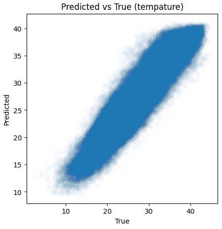
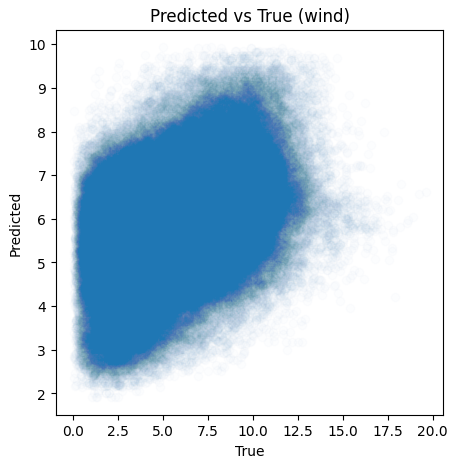
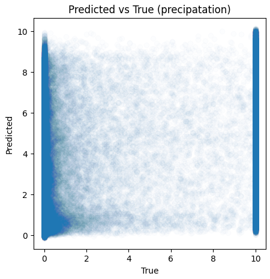
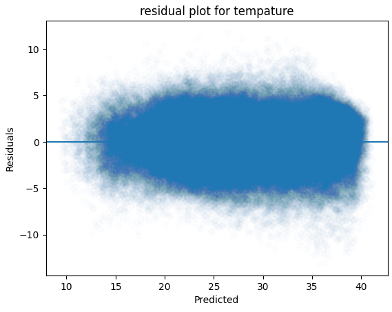
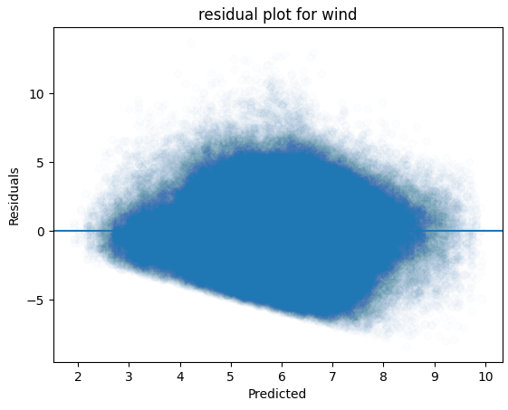
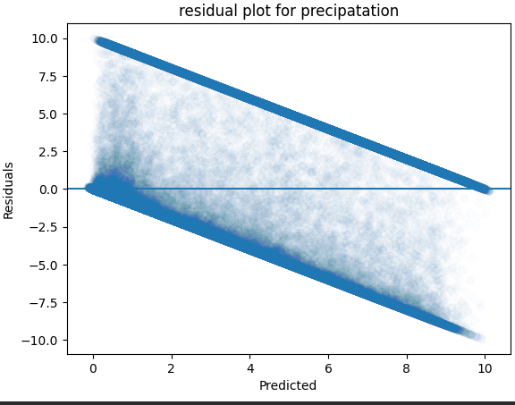
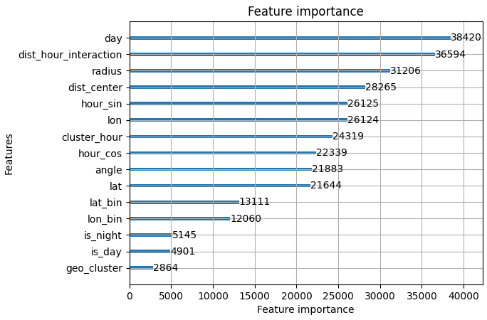

# Nasa Hackathon Weather Prediction

The Model predict the tempature, the wind speed and the precipitation, in a certain hour of the day (the prototype only trained on the first 5 days of october), in a certain point in the whole area of Morocco. All based on 4 inputs: latitude, longitude, day and hour.

The website is live on [nasaweither.me](https://nasaweither.me/)

## Table of contents

* [1. Getting Data](#1-getting-data)
* [2. Merging Data](#2-Merging-and-Cleaning-Data)
* [3. ML Feature Creating](#3-ML-Feature-Creating)
* [4. Training the model](#4-Training-the-model)
* [5. Results and Analyse](#5-Results-and-Analyse)

------
------

### 1. Getting Data:

In this project we couldn't use any data we want, we had to use data from a specific list of platforms (if this wasn't the case, we could use more specific data of a small area (city metropolis) 
and it would give us more specific prediction). the NASA owned Eartdata platform was the best option we had,so we used it.
In the platform we extracted 4 variables:

    U50M (eastward_wind_at_50_meters) from MERRA-2 code: M2T1NXSLV
    V50M (northward_wind_at_50_meters) from MERRA-2 code: M2T1NXSLV
    T2M (2-meter_air_temperature) from MERRA-2 code: M2T1NXSLV
    PRECTOT (total_precipitation) from MERRA-2 code: M2T1NXFLX

The task of downloading files, choosing these 4 variables and converting each file from .nc4 to .csv (NetCDF-4 files are multi-dimentioanl and for this project we only need 2, plus 
csv files are easier to work with in python) is automated in the file auto.py. we choose to only work on the area of Morocco (-18, 20, 0, 36) instead of the world and the area is 
specified in the variable "bbox", so what's happening each time is:
  +  We choose the day we want, we access earthdata database directly using earthdata python modul, we download 2 granules (granule in Nasa terms is a set of data usually in
one day in one file ) one is M2T1NXSLV and the other is M2T1NXFLX.
  +  The two .nc4 files are parsed using xarray python model.
  +  We extract the 4 variables.
  +  We calculate windspeed variable using U50M and V50M.
  +  We convert the tempature to °c.
  +  We define lat (Latitude) and lon (Longitude) variables, so that every spot/pixel can have PRECTOT, T2M and windspeed.
  +  We extract the whole info into a csv file.

------
### 2. Merging Data:

At this point we have 125 csv fils, each has infos of one day.  
This stage is where we combine 5 files (5 days) into one file (1 year).

------

### 3. ML Feature Creating:

This is the most important part of the project, feature engineering is where you transforme data into usefull data. bollow the ones we created:

 + lon, lat, day: normal features that we started with (we didn't use hour feature, but the valuable informaion is extracted in hour_sin and hour_cos features)
 + is_day, is_night: this one is important, because it helps the model distinguish between the day and the night.
 + hour_sin, hour_cos: it helps the model learn that 00 is next to 23, without this, the model would differ between 23 and 00.
 + dist_center: it uses the haversine fomula, and it calculate the distance between the center of the map and a certain point.
 + radius, angle: it calculates the raduis and the angle between the latitudea and longitude.
 + lat_bin, lon_bin: this turns latitude and longitude into integrals and inflate them, this helps the model to eliminate locality and draw patterns instead of just memorizing.
 + geo_cluster: it uses kmeans to assign a cluster from 0 to 19 for each geographic position (kmeans model is saved so to be used in prediction).
 + cluster_hour: it combines the geographic cluster with the hour.
 + dist_hour_interaction: it calculates the product between dist_center and the hour_sin, it helps the model find a relashenship between them.

--------

### 4. Training the model:

We started by using Random Forest, it's good with lag and mean features, but in this project we cann't use these features (because of far future prediction), and Random Forest doesn't really understand or draw relasheship features (like cluster_hour). But we did train it using Random Forest and lag and mean features, but the score wasn't that good and model file was like 8gb (compared to 100mb with LightGBM).
  We ended up settling for a gradient boosting model where each new tree tries to correct the last one, (for our tabular data, they say sometimes gradient boosting outperforms neural networks). 
  LightGBM was our best choice, Developed by Microsoft in 2016 (so it's quiet new), it fast and very memory efficient, 
  I used LightGBM in a multi output regression setup with 3 estimators, one for each target (tempature, wind and precipitation), and each is trained separately, so it's kind of 3 models at the same time. 

--------

### 5. Results and Analyse:

  In the above we can check the comparison between the predicted and true values for each target.<be> We can notice that the tempature model is quiet perfect.  But the wind model wasn't that good, and that is due to the spontaneity and locality of the wind parameter, the true values are going from 0 to 20, but the predicted go only from 2 to 10, so the model tries to calculate the mean.  The third picture gives use the precipitation parameter.

  These pictures shows us the residual plot for each parameter, the first two look quiet normal, but the third one is very different, as it shows that most of the predicted values are not real, and deviated from the true values.

  This one is the representation of the importance of each feature (for tempature target). Day feature is in the top, then distance hour interaction feature. these 2 are the basline of the model to predict, the shoking is the low level of importance of geo_cluster feature, but i think that this is due to it being used in the final trees, as it's a 20 class feature

----------
----------
----------
----------
----------
----------

The scores bellow are the classic ones:

|  | Tempature | Wind | Precipatation |
|----------|----------|----------|----------|
| R2 score  | 0.87227  | 0.16010  | 0.37132  |
| MSE  | 4.53478  | 5.89238  | 13.70370  |
| MAE  | 1.55270  | 1.93998  | 2.78202  |

